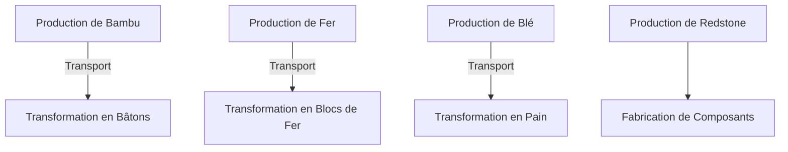

## Qu'est-ce qu'un micro-service ?
Un micro-service est une petite application autonome qui réalise une tâche spécifique. Dans une architecture logicielle basée sur des micro-services,
plusieurs services spécialisés collaborent pour former une application complète.

## L'usine Minecraft: une métaphore parfaite
Dans la vidéo d'Aypierre, on découvre une immense usine automatisée composée de plusieurs modules indépendants.
Chaque module a function bien définie, comme:

- **Production de ressources brutes**:
    - Bambu => utilisé pour fabriquer du bois.
    - Redstone => composant essentiel pour les circuits.
    - Fer => transformé en blocs de fer ou en outils.
    - etc...
- **Transformation des ressources**:
    - Le bambu est transformé en bâtons pour fabriquer des outils.
    - Le fer est combiné avec du bois pour produire des hoppers.
    - Le blé est transformé en pain.

## Les micro-services dans l'usine
Dans cette usine Minecraft, chaque module de production correspond à un micro-service:
- **Indépendance**: Chaque module fonctionne indépendamment. Si la ferme à fer tombe en panne, la production de redstone continue.
- **Communication**: Les modules communiquent via des pipelines de transports d'objets, similaires aux API Dans le monde des micro-services.
- **Scalabilité**: Besoin de plus de fer ? Ajoutez simplement plus de modules de production de fer.
- **Résilience**: Si un module s'arrête, l'usine globale peut continuer à fonctionner partiellement.

## Design Pattenrs appliqués
L'usine Minecraft illustre également certains **Design Patterns** informatiques:
- **Pipeline**: Chaque module traite les éléments reçus et les transmet au suivant.
- **Factory Method**: Les modules fabriquent des objets à partir de matériaux bruts.
- **Singleton**: Certains modules critiques comme la ferme à fer sont uniques.
- **Observer**: Les modules surveillent la disponibilité des ressources avant de produire.

## Gestion des Défaillances
Dans Minecraft, les sytèmes sont sujetsà des pannes: des entonnoirs peuvent être surchargés, des items peuvent être perdus. Cela illustre la nécessité de **gestion des erreurs** en informatique:
- **Détection des pannes**: Les systèmes doivent surveiller les erreurs et réagir en conséquence.
- **Reprise automatique**: Après une panne, les micro-services doivent redémarrer automatiquement.
- **Mécanismes de tolérance**: Par exemple, la redondance des fermes permet de compenser un arrêt imprévu.

## Communications synchrones et asynchrones
Dans Minecraft, les items sont transportés de manière automatique (asynchron) à travers des convoyeurs. Si un module en amont ralentit, les modules en aval peuvent être affectés.
Dans un système informatique, cela correspond à la communication asynchrone (par exemple via des files de messages comme RabbitMQ, Kafka ou PubSub). Si un micro-service tombe, les messages sont mis en attente jsuqu'à ce qu'il soit de nouveau opérationnel.

## Sécurité et Permissions
Comme dans les systèmes informatiques, il est crucial de **contrôler les permissions**: seuls certains modules doivent avoir accès à des ressoruces critiques.
- **Principe du moindre privilège**: Chaque module doit avoir uniquement les permissions nécessaires.
- **Gestion des accès**: Des systèmes d'authentification contrôlent les interactions entre services.
- **Audit**: Les actions des modules sont enregistrées pour une traçabilité.
- **Sécurité des données**: Les ressources critiques doivent être protégées contre les intrusions.
- **Chiffrement**: Les données sensibles doivent être chiffrées pour éviter les fuites.
- **Gestion des clés**: Les clés d'accès aux ressources doivent être sécurisées.
- **Gestion des identités**: Les modules doivent être identifiables pour une gestion fine des permissions.

## Supervision et Monitoring
Les systèmes complexes nécessitent un **monitoring constant**. Dans l'usine Minecarft, Aypierre surveille en permancence ses modules:
- **Tableaux de bord**: Les indicateurs clés sont affichés en temps réel.
- **Alertes**: Des notifications sont envoyées en cas de problème.
- **Logs**: Les actions des modules sont enregistrées pour une analyse ultérieure.
- **Métriques**: Les performances des modules sont mesurées pour détecter les ralentissements.
- **Tracing**: Les interactions entre modules sont tracées pour comprendre les problèmes de performance.
- **Corrélation**: Les événements sont reliés pour comprendre les causes profondes des pannes.
- **Rétention des données**: Les logs et métriques sont conservés pour une analyse à long terme.

## Conclusion
L'usine Minecraft d'Aypierre est un excellent visuel pour expliquer les micro-services. Chaque module remplit
une fonction précise, communique avec les autres et peut être amélioré ou remplacé indépendamment.
C'est exactement ainsi que fonctionne une architecture basée sur des micro-services.

Alors, la prochaine fois que vous entendrez parler de micro-services, pensez à [cette usine de redstone et à ses modules indépendants](https://www.youtube.com/watch?v=RfIlzb0XwWg) !